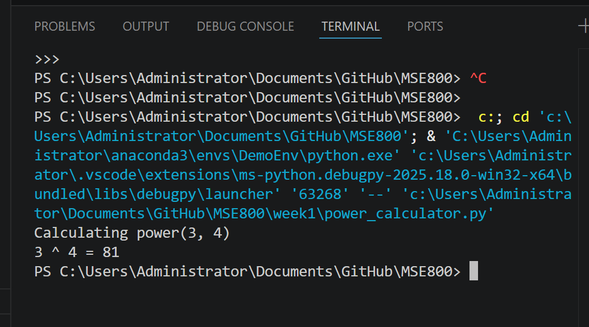

# MSE800-PSD Week1 Project: Power Calculation
## Project Description
This project implements a function to calculate the power of two numbers (x^y). It supports both integer and floating-point inputs, includes user input validation, and provides a clear interactive interface.

## Features
1. Calculate x to the power of y (xʸ)
2. Support integer and floating-point base/exponent
3. Input validation for invalid non-numeric values
4. Clear user interaction and result display

## Environment
- Programming Language: Python 3.8+
- Operating System: Windows/macOS/Linux
- No additional dependencies required

## Screenshots
### 1. Development Environment

### 2. Program Running Result

## How to Run
1. Clone the repository
2. Navigate to the Week1 directory
3. Execute the script: `python power_calculator.py`
4. Follow the prompts to input base (x) and exponent (y)